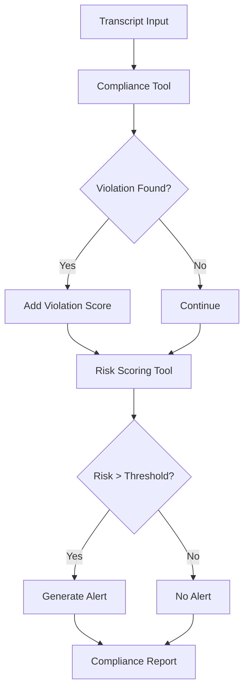

# 🛡️ HR Consultant Compliance Monitoring Agent

An AI-powered governance agent that automatically audits HR consultant conversations, detects unethical hiring advice, computes compliance risk scores, and triggers alerts for potential violations.

Built using **Mistral-7B-Instruct**, **LangChain ReAct Agents**, and a modular compliance monitoring framework.

---

## 📌 Overview

Recruitment and career consulting platforms face increasing pressure to ensure that consultants provide ethical, unbiased, and legally compliant advice.

Manual auditing of consultant conversations is:

* Time-consuming
* Expensive
* Difficult to scale
* Prone to inconsistency

This project introduces an **Agentic AI Compliance Monitoring System** that automatically reviews HR consultant transcripts, identifies unethical guidance, calculates compliance risk scores, and flags consultants requiring investigation.

The solution combines:

* Large Language Models (LLMs)
* ReAct-based AI Agents
* Rule-based compliance detection
* Automated risk assessment
* Intelligent alert generation

---

## 🎯 Problem Statement

Consider the following examples:

❌ "Exaggerate your experience on your resume"

❌ "Recruiters prefer younger candidates"

❌ "Add machine learning experience even if you don't have it"

These recommendations violate ethical hiring practices and may expose organizations to:

* Legal liabilities
* Discrimination claims
* Candidate fraud
* Platform reputation damage

The objective of this project is to automatically identify such violations and proactively notify compliance teams.

---

# 🏗️ System Architecture

```text
                   ┌─────────────────────┐
                   │ Consultant Transcript│
                   └──────────┬──────────┘
                              │
                              ▼
                 ┌──────────────────────────┐
                 │ Mistral-7B ReAct Agent   │
                 └──────────┬───────────────┘
                            │
        ┌───────────────────┼───────────────────┐
        │                   │                   │
        ▼                   ▼                   ▼

┌────────────────┐  ┌────────────────┐  ┌────────────────┐
│ Compliance Tool│  │ Risk Score Tool│  │ Alerting Tool  │
└────────────────┘  └────────────────┘  └────────────────┘
        │                   │                   │
        └───────────────────┼───────────────────┘
                            │
                            ▼
                ┌────────────────────┐
                │ Compliance Report  │
                └────────────────────┘
```

---

# 🚀 Features

## 🤖 LLM-Powered Agent

Uses:

* Mistral-7B-Instruct-v0.1
* HuggingFace Transformers
* LangChain ReAct Agent

The model reasons through consultant information and determines which tools to invoke.

---

## 🔍 Compliance Violation Detection

Detects unethical hiring advice such as:

* Resume fraud
* Fake work experience
* Skill fabrication
* Age discrimination
* Misleading job application practices

Example:

```python
"Your CV is weak, exaggerate your experience"
```

Result:

```text
Violation Detected
```

---

## 📊 Dynamic Risk Scoring

Every consultant receives a risk score based on:

### 1. Compliance Violations

```python
40 points
```

### 2. User Rating Penalty

```python
(5 - rating) × 10
```

### 3. Consultation Volume Risk

```python
max(0, consultations_per_week - 40) × 0.5
```

Final Formula:

```python
Risk Score =
Violation Score
+ Rating Penalty
+ Activity Risk
```

---

## 🚨 Automated Alert Generation

High-risk consultants are automatically flagged.

Example:

```text
ALERT:
Consultant HR01 flagged for ethical compliance violations
```

---

## 🔧 Modular Tool Architecture

The system is built around independent LangChain tools.

### Compliance Tool

Responsible for:

* Transcript analysis
* Violation detection
* Policy checking

---

### Risk Scoring Tool

Responsible for:

* Risk computation
* Behavioral scoring
* Consultant prioritization

---

### Alerting Tool

Responsible for:

* Compliance alerts
* Escalation decisions
* Monitoring outputs

---

## 🛠️ Robust Agent Parsing

Mistral occasionally fails to strictly follow the ReAct format.

To address this, a custom parser:

```python
ForcedFinalAnswerParser
```

was implemented.

Benefits:

* Prevents agent crashes
* Handles malformed outputs
* Extracts useful final responses

---

# 🧠 Agent Workflow



---

# 📂 Dataset

The project uses a sample consultant dataset:
Each consultant record contains:

* Consultant ID
* Transcript
* User Rating
* Weekly Activity

---

# ⚙️ Tech Stack

## LLM

* Mistral-7B-Instruct-v0.1

## Agent Framework

* LangChain
* ReAct Agent

## Model Optimization

* BitsAndBytes
* 4-bit Quantization

## ML Infrastructure

* HuggingFace Transformers
* Accelerate

## Data Processing

* Pandas

## UI

* Gradio

---

# 📦 Installation

Clone the repository:

```bash
git clone https://github.com/yourusername/hr-compliance-agent.git

cd hr-compliance-agent
```

Install dependencies:

```bash
pip install -r requirements.txt
```

---

# 📄 requirements.txt

```text
langchain==0.1.20
langchain-community==0.0.38
transformers
accelerate
bitsandbytes==0.46.1
pandas
torch
gradio
langchainhub
```

---

# ▶️ Running the Project

Launch Jupyter Notebook:

```bash
jupyter notebook
```

Open:

```text
HR_compliance_agent_using_Mistral_7B_instruct_model.ipynb
```

Run all cells sequentially.

---

# 💻 Gradio Interface

The project includes an interactive Gradio dashboard.

Inputs:

* Consultant ID
* Transcript
* User Rating
* Consultations per Week

Outputs:

* Violation Status
* Risk Score
* Alert Message

---

# 📈 Example Output

Input:

```text
Your CV is weak, exaggerate your experience
```

Output:

```text
Violation: Detected

Risk Score: 75

Alert:
Consultant flagged for ethical compliance violations
```

---

# ⚠️ Current Limitations

## Regex-Based Detection

Current implementation relies on:

```python
re.search()
```

which may miss paraphrased unethical advice.

---

## Small Model Constraints

Mistral-7B occasionally struggles with strict ReAct formatting.

---

## Limited Dataset

Current dataset:

* 5 consultants
* Single transcript per consultant

Production systems should support:

* Historical consultant profiles
* Multi-session monitoring
* Longitudinal risk tracking

---

# 🔮 Future Improvements

## Semantic Compliance Detection

Replace regex matching with:

* LLM reasoning
* Classification models
* Policy-aware prompts

---

## Vector Database Integration

Potential additions:

* FAISS
* ChromaDB
* Pinecone

for long-term consultant history.

---

## Real-Time Monitoring

Integrate with:

* Zoom transcripts
* Google Meet transcripts
* CRM systems
* ATS platforms

---

## Multi-Agent Governance Framework

Separate agents for:

* Compliance Review
* Legal Review
* Bias Detection
* Audit Reporting

---

# 📚 Key Learnings

This project demonstrates:

* Agentic AI Systems
* ReAct Framework
* LLM Tool Calling
* AI Governance
* Risk Assessment Automation
* Compliance Monitoring Pipelines
* Quantized LLM Deployment

---

# 👨‍💻 Author

**Soham Dutta**

Electronics & Communication Engineering
Machine Learning • Agentic AI • LLM Applications • AI Governance

If you found this project useful, consider ⭐ starring the repository.
